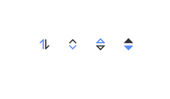

# SortArrow
> 排序图标  



## props
- `name`: String 显示排序图标名 `['arrow', 'arrow-side', 'triangle', 'triangle-fill']`
- `color`: String, 图标颜色
- `activeColor`: String, 图标高亮颜色
- `size`: Number, 图标大小
- `sort`: String, 排序方式 ['ascend', 'descend']
- `horizontal`: Boolean 是否横向显示

## event
- `click(value)`


## example

```html
<AppSortArrow activeColor="#598CFF" />

<AppSortArrow name="arrow" activeColor="#598CFF" color="#505050" :size="24" sort="ascend" horizontal />
```